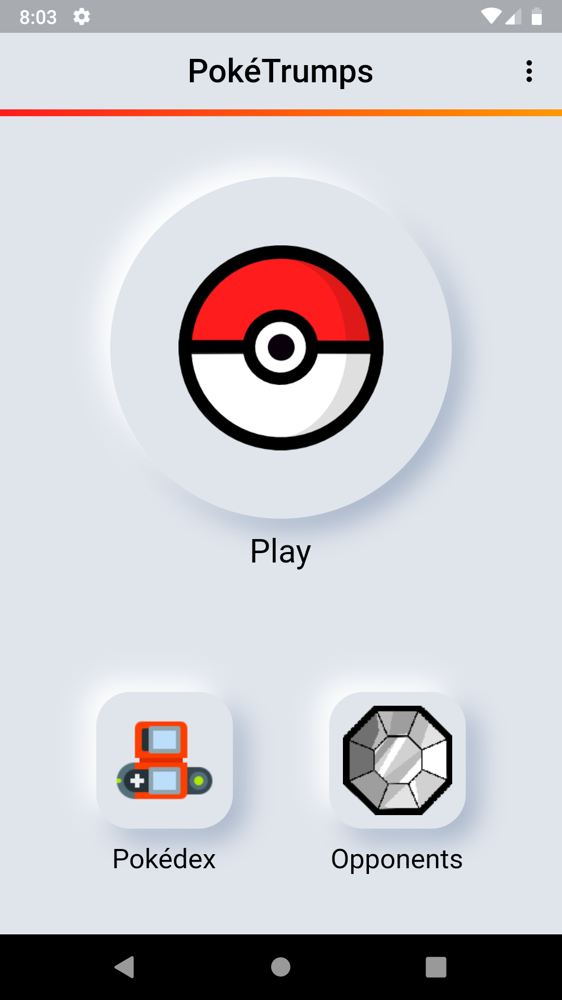
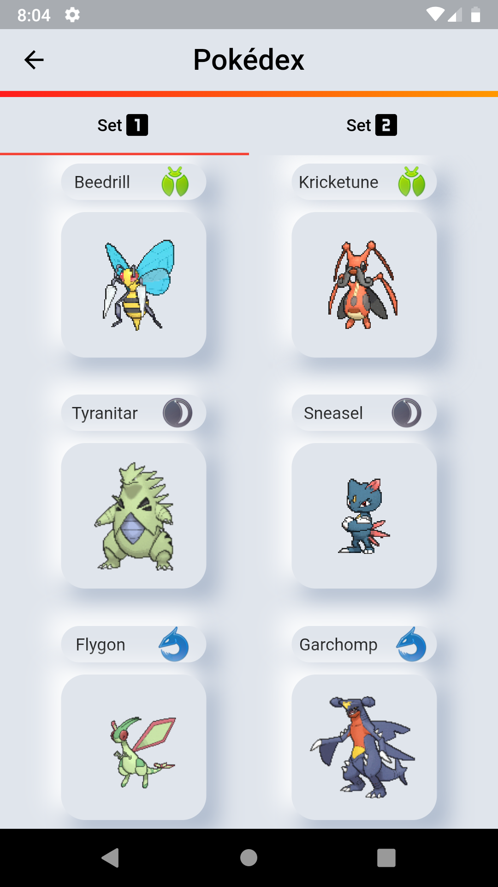
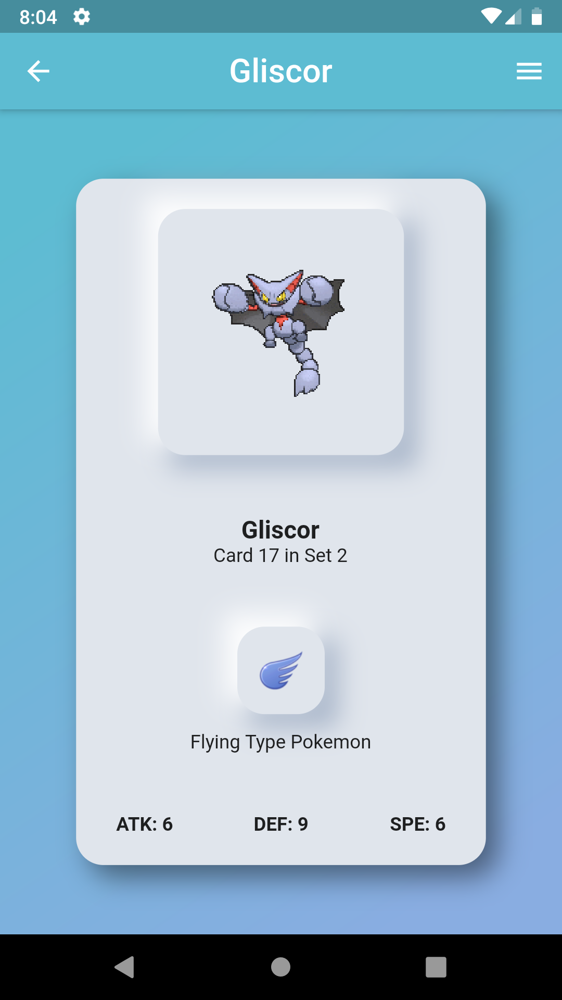
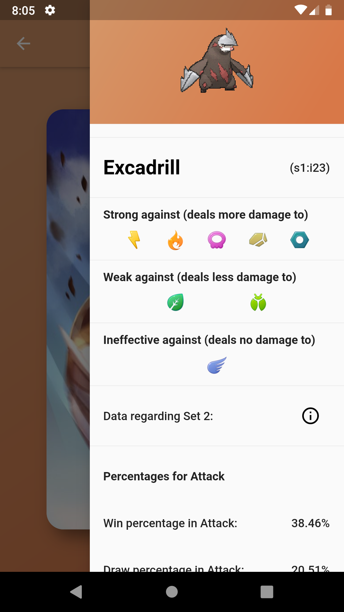
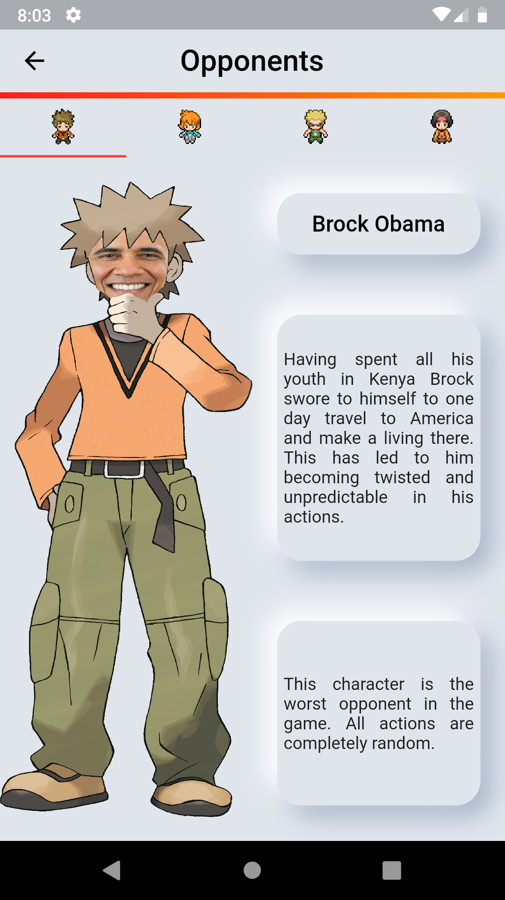
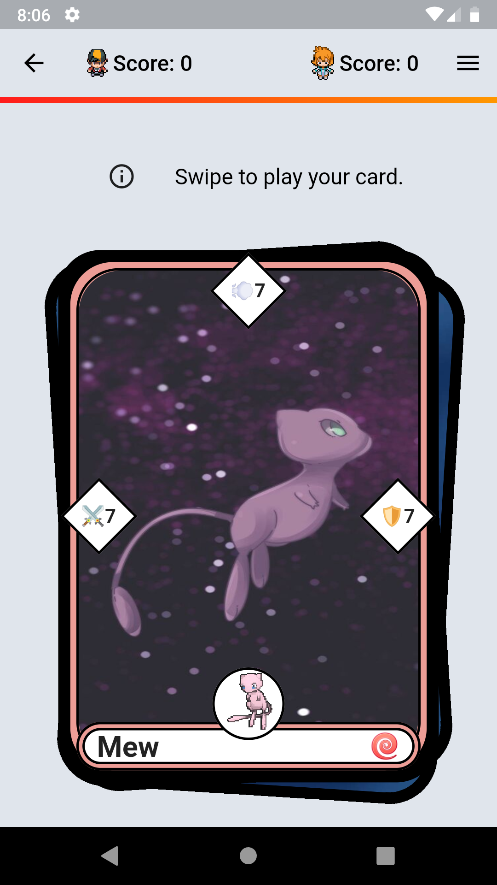
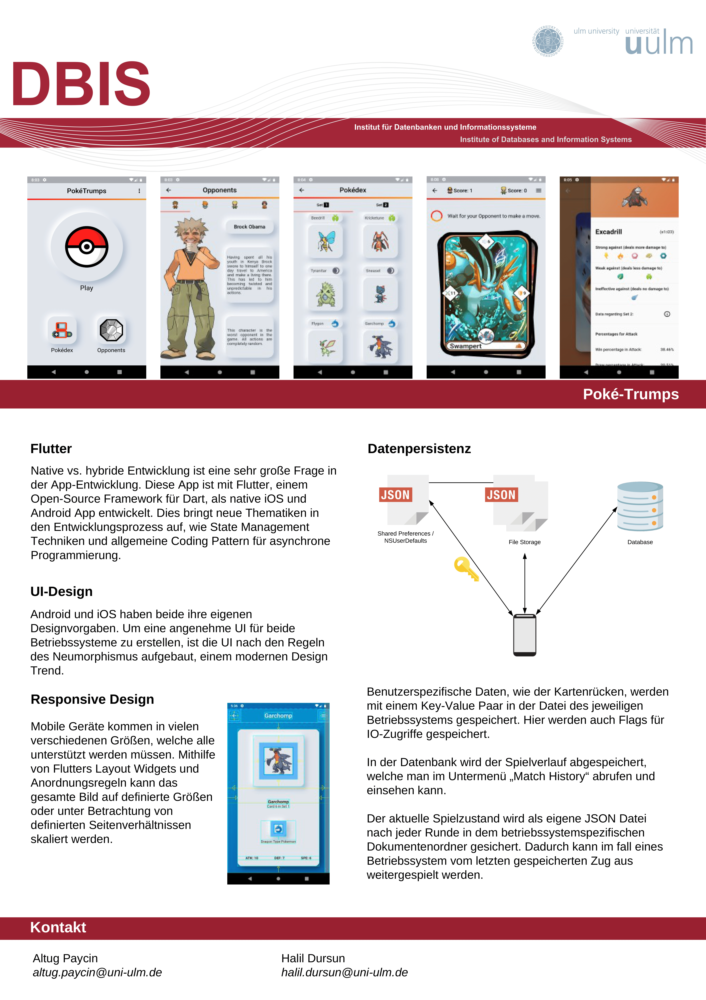

PokéTrumps
==========

A Flutter project for the course Mobile Application Lab (WiSe 2019/20, Ulm University).
The goal of this project is to create a `Top Trumps` game involving Pokémon cards in the form
of a native app for both iOS and Android.

---

## ⚠️ Disclaimer
The following project was edited to avoid any copyright issues.
All media is self made. Images in the `Screenshot` section below depict the app
in its previous state. If this app is build from this repository's source code,
all the images will look different to avoid copyright infringement. Artists of the
previously used (and shown) images are credited in a table below.

---

## 🔧 Build

To build the app use `flutter build apk --split-per-abi` to create three different apks. Then use
`flutter install` while having the phone connected to the computer. This installs the correct apk
to the phone. Building an iOS app is tedious and we advice not to do it, but if you want to use
<a href="https://flutter.dev/docs/deployment/ios">this link</a>.

There are pre build apks in the distribution `./pre-build_apks/`, 1 fat apk and 3 architecture specific
apks. We hope they work, too.

## 🐛 Debug

To start the app in debug mode just open `./main.dart` and start debugging (F5 in VS Code, every other 
IDE/Editor is trash for Flutter). The code won't be something you want to look at if you havn't installed
some VS Code specific utility plugins for Flutter developement. The path provider plugin deprecation warning
in the terminal is normal, it will work perfectly if the versions aren't manually updated in `./pubspec.yaml`.

## 🎯 Focus

The focus of this application was to learn how to create basic cross-platform mobile applications.
This includes learning Dart/Flutter, learning how to work asynchronously and learning to use different
approaches to achieve basic functionality of apps like data persistence.

### Responsiveness

Flutter provides multiple Widgets to create a responsive screen. Every screen of our app consists of
such widgets, yet we also used Widgets that are "hard coded in size" to recreate the MTG card aspect ratio
(PokemonCardWidget and PokemonCardRepresentation in the Pokedex). Essentially responsiveness is achieved by
Flutters automatic spacing, but some Widget sizes, text font sizes, etc. are not completely responsive.

### Data Persistence

Storing data and re-using that data through multiple app launches is an important part of this project.
Flutter allows us to store data persistently in three different ways, which were all used in this project.

#### SharedPreferences & NSUserDefaults

Basic data like settings regarding which card sleeve to use or which is the user's preferred set is stored
in a key-value data structure via Flutter's SharedPreferences plugin. SharedPreferences are used in the
Android versions of this app, NSUserDefaults in the iOS version. This way we can guarantee that the user's
preferences are stored in a way in which they don't get lost on the next launch.

#### Storing Custom Files

More complex data like our GameData (a representation of the current game state) is stored by creating a
json file with the GameData object as a Map. After every battle the file is overridden with the new state.
If a game has not ended when the app terminated, for instance if a crash caused the termination, the state
is loaded from the json file on launch and the game can continue from the last saved turn. The file is
called game_data.json and is stored in the AppData folder on Android or the NSUserDocuments folder on iOS.

#### Database

Storing a lot of data with a similar structure is done by using a database. We used an embedded SQLite
database to do that. Every time a game ends, a GameHistoryEntry object is created and then asynchronously
added to the database. If the database hasn't existed to that time, it gets created before the entry is
added. In the History screen all data from our only table in the database is fetched and mapped to a
representation of that data and displayed in a ListView.

### Design

Since we theoretically have an iOS and an Android app, we had to make up our mind on how to design the UI.
We did not want to use Material Design on iOS and did not want to use Cupertino Widgets on Android. We also
did not want to translate our Widgets to native looking Widgets after querying the user's OS. So we instead
read an article on Neumorphic Design and tried to add our own twist to that.

## 👀 Showcase

### Video of current Version

https://user-images.githubusercontent.com/58511096/126072879-c00f6709-31ec-4343-b4cb-63d424909436.mp4

### Screenshots of the old Version
Using good looking assets, like official Pokémon assets, and replacing the programmer art in this version
of the project one can create the privately created first version of this app. A quick demonstration:

    
    </img>
    

    
    </img>
    

    
    </img>
    

#### Credits for the images
| Image | Source |
| ----- | ------ |
| Pokéball Icon | Taken from [Wikipedia](https://en.wikipedia.org/wiki/File:Pokeball.PNG) |
| Pokédex Icon | <a target="_blank" href="https://icons8.com/icon/16460/pokedex">Pokedex</a> icon by <a target="_blank" href="https://icons8.com">Icons8</a> |
| Gym Badge Icon | Image from the official Pokémon Games, taken from [Pokéwiki](https://www.pokewiki.de/) |
| Pokémon Gifs | Pokémon Gifs from the official Pokémon Games, taken from [Pokéwiki](https://www.pokewiki.de/) |
| Pokémon Type Icons | Icons from the official Pokémon Go App taken from [PokemonGo.Fandom](https://pokemongo.fandom.com/wiki/Types) |
| Character Images | Edited Versions of official character artworks from Pokémon Games, taken from [Pokéwiki](https://www.pokewiki.de/) |
| Mew Card Art | Made by [AutobotTesla](https://www.deviantart.com/autobottesla) |

### Poster
As part of the submission of this project, a poster has been created. It contains basic
information about this project and displays the most important points of the app in
German.

